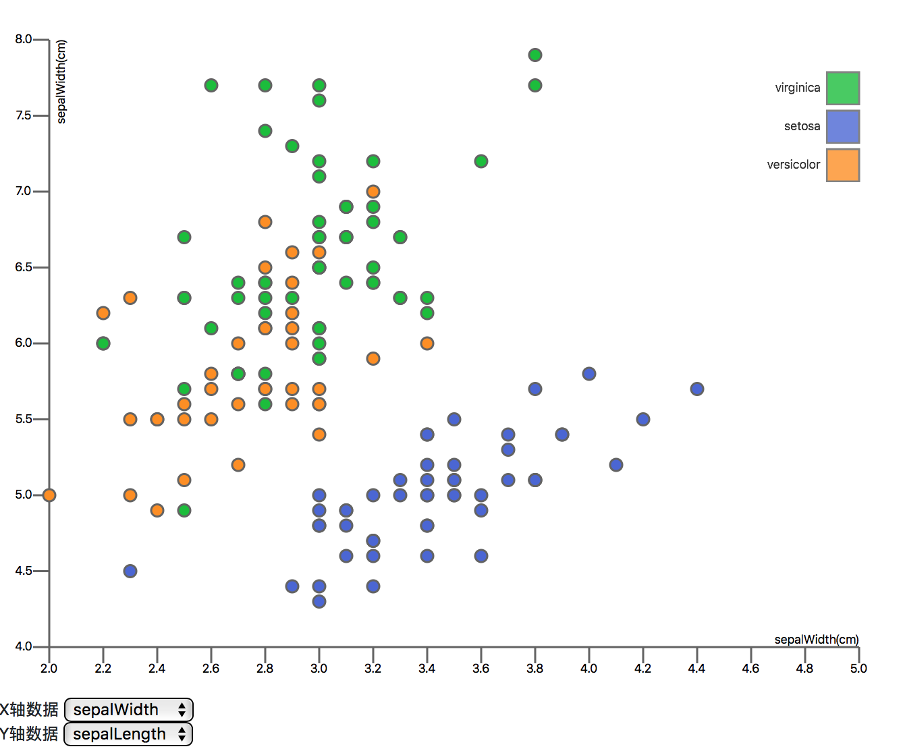

# svg_scatter_figure

This is a simple demo that uses svg to display scatter plots in the browser.
The data is defined in a json array. I extract the fields from the
array as the X-axis or Y-axis and mark them with circles.

## Screenshots

